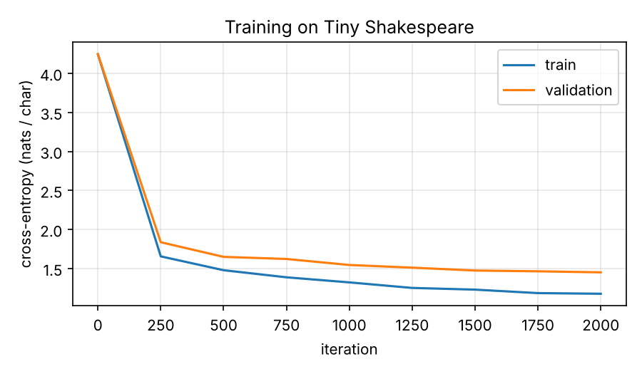
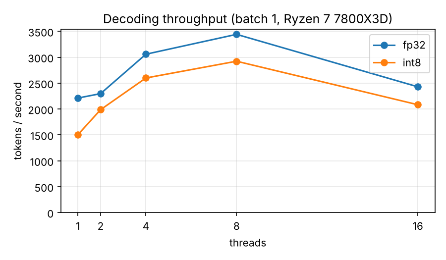

# Quill — a tiny LLM and a from-scratch inference engine in Rust

I trained a 5M-parameter Llama-style transformer on Shakespeare in PyTorch, then
wrote the engine that runs it in Rust without an ML framework. The engine handles
attention, a KV cache, int8 quantization and multithreading, and it compiles to
WebAssembly so the model runs entirely in the browser.

**[Live demo](https://gaming7810.github.io/neww/)** · [Benchmarks](#results) · [What didn't work](#what-didnt-work)

```
$ quill generate --prompt "JULIET:"
JULIET:
Thou art most news like a queen with the prover-night;
His hands all such conference to give him how;
But who not to the matter of these treasure
And he of our sickless commission
To his heir enemy in the son, and that proceeds
I would sanctuary to my lamb; for thou, permit me
all the people still purpose of a grace of itself,
yet I have prigout of my daughter.
```

## How it fits together

```
train/ (Python, PyTorch)                    engine/ (Rust, no ML dependencies)
  prepare.py   text -> char tokens            model.rs   file loader + forward pass + KV cache
  model.py     RMSNorm, RoPE, SwiGLU   ───►   ops.rs     dot / matmul / RMSNorm / softmax
  train.py     AdamW, cosine schedule  .bin   quant.rs   int8 group-wise quantization
  export.py    weights + test vectors         main.rs    CLI: generate, bench, ppl, report
                                              wasm.rs    C-style API for the browser
                                                    │
                                                    ▼
                                          docs/  demo page (WebAssembly, no server)
```

`train/model.py` and `engine/src/model.rs` are meant to be read side by side: each
PyTorch operation has a hand-written counterpart in Rust.

**Correctness is tested, not assumed.** `export.py` saves PyTorch's logits for a fixed
input, and `engine/tests/pytorch_parity.rs` checks that the Rust engine reproduces them.
The fp32 path matches to within 6×10⁻⁶ (max absolute logit difference). The int8
path is checked to pick the same next token. CI runs these tests, plus clippy, rustfmt
and a WebAssembly smoke test in Node, on every push.

## Model

| | |
|---|---|
| Architecture | Llama-style decoder: RMSNorm, rotary position embeddings, SwiGLU MLP, tied input/output embeddings, no biases |
| Size | 6 layers, 8 heads, d_model 256, d_ff 768 — **5.13M parameters** |
| Tokenizer | Character-level, 65 symbols |
| Data | [Tiny Shakespeare](https://github.com/karpathy/char-rnn) (1.1M characters, 90/10 split) |
| Training | 2,000 steps × 32 sequences × 128 chars, AdamW, cosine LR, dropout 0.1, bf16 mixed precision — **48 seconds on an RTX 5070** (the same run took 28 minutes on a 4-core cloud CPU) |
| Result | validation loss **1.469** nats/char (perplexity 4.34) on the full validation set |



## Int8 quantization

Weights are split into groups of 32 values. Each group stores 32 `i8`s plus one `f32`
scale (`scale = max|w| / 127`), which comes to 1.125 bytes per weight instead of 4.
Activations are quantized the same way just before each matmul, so the inner loop is an
`i8 × i8 → i32` dot product, with one float multiply per group
(`engine/src/quant.rs`). The unit tests check two properties:

- the integer kernel gives exactly the same result as an f32 matmul over the dequantized values, so all of the error comes from rounding, none from the kernel;
- the error of each output stays within the analytical bound Σ(|w|·δx + |x|·δw + δw·δx).

## Results

### Quality

Measured on all 871 non-overlapping 128-character windows of the validation set
(111k predictions). "Agreement" is the fraction of positions where int8 predicts the
same most likely next character as fp32.

| | fp32 | int8 |
|---|---|---|
| Linear-layer weights | 20.5 MB | **5.8 MB** (3.6× smaller) |
| Validation loss (nats/char) | 1.4690 | 1.4691 (+0.0001) |
| Perplexity | 4.345 | 4.345 |
| Same top-1 prediction as fp32 | — | 99.5% |

PyTorch's loss on the same windows is **1.4690**. The Rust fp32 engine gives the same
number, as it should.

### Speed

Generating 128 tokens one at a time (batch size 1), in tokens per second. I measured on
two machines with very different caches, and the results disagree in an instructive way.

| | **Ryzen 7 7800X3D**<br>8 cores / 16 threads, 96 MB L3 | **Cloud VM**<br>4 vCPUs, shared |
|---|---|---|
| fp32, 1 thread | 2,212 | 844 |
| int8, 1 thread | 1,504 – 2,037 | 1,131 |
| fp32, best thread count | 3,442 (8 threads) | 1,247 (2 threads) |
| int8, best thread count | 2,923 (8 threads) | 1,427 (2 threads) |
| fp32, 1 thread, `-C target-cpu=native` | 1,773 | ~720 |
| int8, 1 thread, `-C target-cpu=native` | **2,944** | **~1,440** |
| WebAssembly (Node 22), fp32 / int8 | — | ~450 / ~215 |

Raw numbers for the Ryzen run are in [`results/benchmarks.json`](results/benchmarks.json).
Regenerate them with `quill report`. Desktop runs are noisy: the portable int8 build
measured 1,504 tok/s in `report` and 2,037 in a separate run, so I report the range.



### Takeaways

- **int8 costs almost nothing in quality.** Validation loss moves by 0.0001 nats, and
  int8 agrees with fp32 on the next character 99.5% of the time.
- **Whether int8 is faster depends on the machine.** On the cloud VM, int8 is 1.34×
  faster even with a portable build. On the 7800X3D, it isn't: the fp32 weights
  (20.5 MB) fit entirely in the 96 MB L3 cache, so reading less memory saves little,
  and the portable build's integer loop costs more than it saves. When the compiler may
  use the CPU's integer dot-product instructions (AVX-512 VNNI, `-C target-cpu=native`),
  int8 becomes the fastest option at 2,944 tok/s, 1.33× the best single-thread fp32
  build. So on this CPU, int8's advantage comes from cheaper arithmetic rather than less
  memory traffic. That interpretation fits all the numbers, but I haven't measured cache
  misses directly yet.
- **A GPU changes the training loop, not just the speed.** 48 seconds per run instead of
  28 minutes makes hyperparameter sweeps practical.

## What didn't work

1. **Multithreading scales poorly.** One token needs about 0.5 ms of single-thread work
   on the Ryzen, spread over 43 matmuls (6 layers × 7, plus the output projection), so
   each parallel region lasts only about 10 µs. Waking and synchronizing rayon workers
   costs about as much as the work they share. Eight cores give only 1.56×, and 16
   threads are slower than 8, because each pair of hardware threads shares one core's
   execution units. On the 4-vCPU cloud VM, throughput already peaked at 2 threads.
   Ideas: parallelize across attention heads within a larger fused region, or decode
   several sequences at once so each matmul has more work.
2. **int8 is 2× *slower* than fp32 in WebAssembly** (~215 vs ~450 tok/s). My hypothesis,
   not yet verified, is that baseline WebAssembly SIMD has no 8-bit dot-product
   instruction, so the widening `i8 × i8 → i32` loop compiles to many more instructions
   than the f32 one. The demo therefore defaults to fp32. Next step: try the
   relaxed-SIMD `i32x4.relaxed_dot_i8x16_i7x16_add` instruction.
3. **`-C target-cpu=native` makes fp32 slower on both machines** (−19% on the Ryzen,
   −18% on the cloud VM) while making int8 much faster. My first guess was that the CPU
   lowers its clock speed for AVX-512 code, but Zen 4 isn't known to do that, and it
   shows the same regression. That points at the code the compiler generates for
   `ops::dot`. One candidate: the 8 partial sums may end up in a single vector register,
   so every fused multiply-add waits for the previous one. Next step: read the
   assembly (`cargo asm`) and try several independent vector accumulators.
4. **A small evaluation set misled me.** In the first training run, the first 64
   validation windows gave a loss of 1.30, but the full validation set gave 1.47. The
   start of the held-out text is simply easier than average. All numbers above use the
   whole validation set.
5. **The model is starting to overfit.** At the end of training, training loss is 1.18
   and validation loss is 1.45 (see the curve). More dropout or more data would likely
   help more than more steps. With 48-second runs on the GPU, this is now cheap to
   explore.

## Run it yourself

```bash
# 1. Train (under a minute on an RTX 5070, about 30 minutes on 4 CPU cores)
pip install -r train/requirements.txt
python train/prepare.py
python train/train.py
python train/export.py          # -> models/shakespeare.bin, models/test_vectors.bin

# 2. Run the engine
cd engine && cargo test --release && cd ..
cargo run --release --manifest-path engine/Cargo.toml -- generate --prompt "JULIET:" --temp 0.8
cargo run --release --manifest-path engine/Cargo.toml -- generate --q8          # int8 weights
cargo run --release --manifest-path engine/Cargo.toml -- report                 # benchmark table
python train/plot.py

# 3. Browser demo
rustup target add wasm32-unknown-unknown
scripts/build_wasm.sh
python -m http.server -d docs   # open http://localhost:8000
```

A trained model is checked in (`models/shakespeare.bin`), so step 1 is optional.

### Training on a GPU

`train.py` uses a CUDA GPU automatically when PyTorch can see one. The forward pass
runs in bf16 mixed precision, while weights and optimizer state stay in fp32. The
checkpoint format is the same, so `export.py` and the engine need no changes.

```bash
# RTX 50-series cards need a PyTorch build with CUDA 12.8 or newer
pip install torch --index-url https://download.pytorch.org/whl/cu128
python -c "import torch; print(torch.cuda.get_device_name())"   # check the GPU is visible

python train/train.py                       # same model as above, now on the GPU
python train/train.py --compile             # optional: torch.compile (needs Triton; on Windows use WSL)

# A bigger model with a longer context (dim and hidden-dim must be multiples of 32)
python train/train.py --dim 384 --n-layers 8 --n-heads 8 --hidden-dim 1152 \
    --seq-len 256 --batch-size 64 --max-iters 5000
```

For experiments that shouldn't overwrite the published results, point the outputs elsewhere:

```bash
python train/train.py --dropout 0.2 --out runs/drop02 --log runs/drop02/log.csv
python train/export.py --ckpt runs/drop02/ckpt.pt --out-dir runs/drop02 --reference runs/drop02/ref.json
QUILL_MODEL_DIR=runs/drop02 cargo test --release --manifest-path engine/Cargo.toml   # parity check
```

On Windows, Rust and Python both work natively. Run the `.sh` scripts from Git Bash or WSL.

## Next steps

- **Fix the fp32 regression under `target-cpu=native`** by splitting `ops::dot` across
  several independent vector accumulators, then check the assembly.
- **Confirm the cache explanation** by counting cache misses (AMD uProf or `perf`)
  for fp32 and int8, or by benchmarking a model too large for the 96 MB L3.
- **Int4 quantization** (two weights per byte), and a comparison of quality against int8.
- **An int8 model file**, to cut the browser download from 20 MB to about 6 MB.
- **Faster int8 in the browser** with WebAssembly relaxed-SIMD dot products.
- **A hyperparameter sweep on the GPU** (dropout, model size, context length) to reduce
  overfitting.
- **Run the int8 matmul on a custom RISC-V core.** I built a pipelined RV32I processor on
  FPGA in a previous project. The next step is a custom dot-product instruction.
